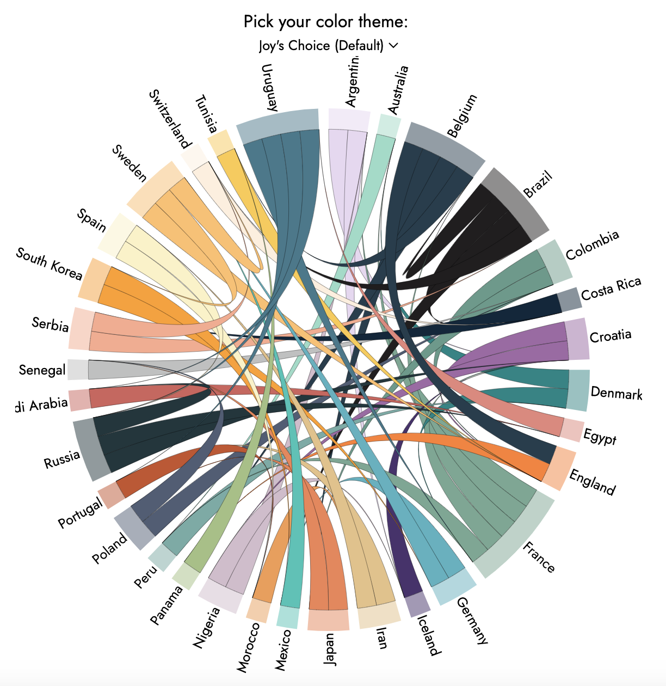

# 2018 FIFA World Cup Chord Diagram Visualization

## Overview

This repository hosts the code and resources used to create an interactive chord diagram visualization of the 2018 FIFA World Cup. The visualization illustrates the relationships between different national teams through their match statistics, providing insights into the flow of goals, passes, and other key game metrics during the tournament.

Explore the interactive visualization [here](https://asahahaha.github.io/chord-fifa2018/).

## Built With

- HTML & CSS: For structuring and styling the web page.
- JavaScript & D3.js: For creating the interactive chord diagram and managing data visualizations.

## Contact

If you have any questions or suggestions, please feel free to contact the repository owner.
